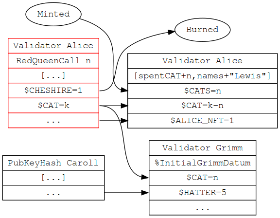
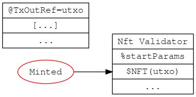
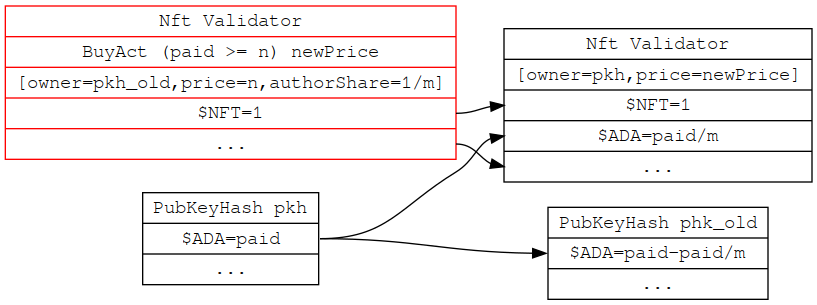
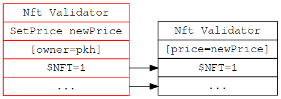

This is a perspective of a transaction that given this Redeemer the ValidatorAlice validates  
It represents all the checks the validator makes

If other validators are part of an "endpoint call" we must draw the diagram including all the checks they make.  
This helps avoid duplicate checks and ensures the safety against manual transaction creating attacks

Reading the spec:  
Red input utxo is the validator we are focusing on. Every piece of information on the diagram is verified by it -- and only that information. 

Each utxo is of form

ValidatorName (or a PubKeyHash)  
Redeemer (Only for the Red/focus utxo)  
Datum ([] for no changes, otherwise list changes inside)  
Value 1   
Value 2  
... (some other values -- if this maps to ... then they must be equal, subtracting any other outgoing values)  

Variables and Properties:  
if a name is prefixed with "%" then it is defined outside of the diagram, presumably right under it and it may take parameters and contain business logic.
if a name is prefixed with "@" then it refers to a property of the utxo -- useful for speccing NFT minting policy for example

Arrows cannot be verified and they are to be considered a mental map (and also the thing that happens in the off-chain code we write). All we care in the validators are the *changes* to the utxos as listed.  
For example:  
$CAT=k -> $CAT=k-n  
$CAT=k -> $CAT=n  
We only check that the utxos hold the exact amounts but not that it came from that specific utxo.  
In contrast ... -> $HATTER=5 means we only check that the Grimm utxo has the 5 tokens on the output, same with ... -> $ALICE_NFT.
Additionally in the presence of "..." at the bottom of a utxo every value existence checks for >= (i.e. $CAT=k means that there's AT LEAST that much $CAT at the utxo -- and potentially some more in the "..." part -- but we only transfer 'k' of it)

Datums flow from the utxo of the same validator to one of the same validator and only the validator in question should check the validity of it. 

Here's some more examples:

NFT minting  

Buying NFT

Setting Price of NFT  

This is an interesting example because it obviously needs the transaction to be signed by the "pkh". We specify that under the diagram.